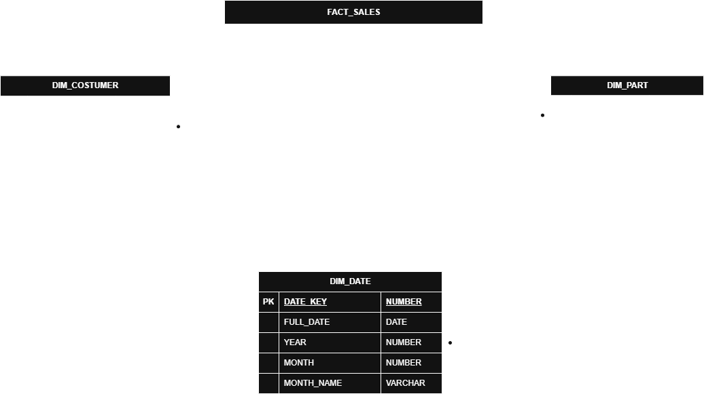

# Ejercicio 1

## Integrantes

`Andrés Proaño` • `Julian León` • `Omar Gordillo` • `Benjamin Vaca` • `Martin Montero` • `Mauricio Mantilla`

---

## Granularidad (Grain)

> **Una fila en la Fact Table = una línea de pedido individual** (un producto dentro de una orden).

Esto corresponde a una fila de `LINEITEM` más algunos datos de `ORDERS`.

---

## Arquitectura del Star Schema



---

## Fact Table: 

- Se precalcula el NET_REVENUE y DISPATCH_DAYS en la populación de la tabla para evitar recalcularlo en cada query porque son aprox 6 mil millones de filas.

- Se usa SHIP_MODE como dimensión degenerada porque solo existen 7 valores distintos (`RAIL`, `AIR`, `SHIP`, `TRUCK`, `MAIL`, `FOB`, `REG AIR`), estos nos evita hacer JOINS costos.

---

## Dimensiones

### `DIM_DATE`

Se usa para Q1 y Q2, que agrupan o filtran por `YEAR` y `MONTH`.

### `DIM_CUSTOMER`

Necesaria para Q1, Q2 y Q4, que agrupan por región o identifican clientes por nombre. Se desnormalizan `NATION` y `REGION` directamente aquí para evitar 2 JOINs extra en cada query.

### `DIM_PART`

Se usa para Q3, que agrupa revenue y unidades por `BRAND` y `MANUFACTURER`.

### `SHIP_MODE` (degenerada en FACT_SALES)

Necesaria para Q5.

---

## Estructura del proyecto

```
Ejercicio 1/
├── README.md              ← este archivo
├── architecture.png       ← diagrama del star schema (draw.io)
├── sql/
│   ├── 01_raw.sql         ← Capa Raw: vistas sobre datos fuente
│   └── 02_gold.sql        ← Capa Gold: star schema (dims + fact)
└── queries/
    ├── queries.sql        ← 5 queries analíticos
    └── results/           ← resultados de los queries (.csv)
```

## Cómo ejecutar

1. Ejecutar `sql/01_raw.sql` — crea vistas sobre `SNOWFLAKE_SAMPLE_DATA.TPCH_SF1000`
2. Ejecutar `sql/02_gold.sql` — crea dimensiones y fact table (la más lenta, ~6B filas ~40 min)
3. Ejecutar `queries/queries.sql` — los 5 queries analíticos sobre el star schema